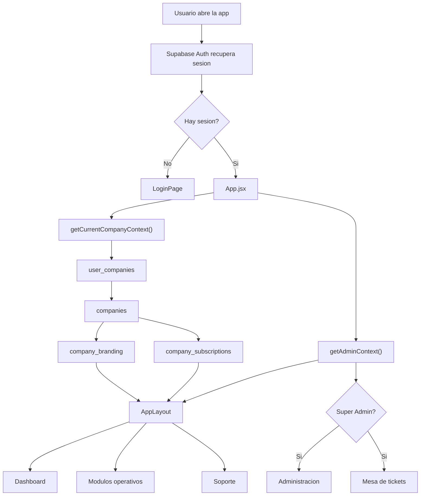

# GYG Costos y Presupuestos

## Resumen

GYG Costos y Presupuestos es una aplicacion web multiempresa orientada a la administracion operativa y comercial de negocios que necesitan:

- control de clientes
- control de productos
- inventario
- proveedores
- vendedores
- cotizaciones en PDF
- punto de venta
- reportes
- soporte por tickets
- administracion central tipo Super Admin

La aplicacion esta pensada para operar con una sola cuenta de usuario que puede administrar una o varias empresas, manteniendo los datos separados por empresa activa.

## Stack Tecnologico

La aplicacion esta construida con:

- `React 19`
- `Vite`
- `React Router`
- `Supabase`
- `jsPDF`
- `jspdf-autotable`
- `XLSX`
- `lucide-react`

Dependencias principales en [package.json](C:/Proyecto/GYG_CostosPresupuestos/gyg-costospresupuestos/package.json).

## Tipo de Aplicacion

La app funciona como una SPA (Single Page Application):

- el frontend vive en React
- la autenticacion se hace con Supabase Auth
- la base de datos vive en Supabase Postgres
- la seguridad se apoya en RLS
- el despliegue productivo se hace en Vercel

## Estructura General del Codigo

### Entrada principal

- [main.jsx](C:/Proyecto/GYG_CostosPresupuestos/gyg-costospresupuestos/src/main.jsx)
  Inicializa React y monta `BrowserRouter`.

- [App.jsx](C:/Proyecto/GYG_CostosPresupuestos/gyg-costospresupuestos/src/App.jsx)
  Controla la sesion, empresa activa, tema, presencia en linea, rutas y proteccion de modulos administrativos.

### Layout

- [AppLayout.jsx](C:/Proyecto/GYG_CostosPresupuestos/gyg-costospresupuestos/src/components/layout/AppLayout.jsx)
  Estructura principal de la app.

- [Sidebar.jsx](C:/Proyecto/GYG_CostosPresupuestos/gyg-costospresupuestos/src/components/layout/Sidebar.jsx)
  Navegacion lateral o superior en movil.

- [Topbar.jsx](C:/Proyecto/GYG_CostosPresupuestos/gyg-costospresupuestos/src/components/layout/Topbar.jsx)
  Header principal con:
  - empresa activa
  - selector de empresa
  - modo light/dark
  - reloj
  - boton salir

- [layout.css](C:/Proyecto/GYG_CostosPresupuestos/gyg-costospresupuestos/src/components/layout/layout.css)
  Estilos globales del layout y de varios modulos.

### Librerias internas

- [supabase.js](C:/Proyecto/GYG_CostosPresupuestos/gyg-costospresupuestos/src/lib/supabase.js)
  Crea el cliente de Supabase.

- [company.js](C:/Proyecto/GYG_CostosPresupuestos/gyg-costospresupuestos/src/lib/company.js)
  Resuelve el contexto de empresa activa:
  - empresa actual
  - branding
  - suscripcion
  - lista de empresas del usuario

- [admin.js](C:/Proyecto/GYG_CostosPresupuestos/gyg-costospresupuestos/src/lib/admin.js)
  Maneja:
  - validacion de super admin
  - bitacora de accesos
  - presencia online

- [excel.js](C:/Proyecto/GYG_CostosPresupuestos/gyg-costospresupuestos/src/lib/excel.js)
  Utilidades para importar y exportar plantillas Excel.

## Modulos de la App

### Operacion

- [DashboardPage.jsx](C:/Proyecto/GYG_CostosPresupuestos/gyg-costospresupuestos/src/pages/dashboard/DashboardPage.jsx)
- [ClientesManagerPage.jsx](C:/Proyecto/GYG_CostosPresupuestos/gyg-costospresupuestos/src/pages/clientes/ClientesManagerPage.jsx)
- [ProductosPage.jsx](C:/Proyecto/GYG_CostosPresupuestos/gyg-costospresupuestos/src/pages/productos/ProductosPage.jsx)
- [InventarioPage.jsx](C:/Proyecto/GYG_CostosPresupuestos/gyg-costospresupuestos/src/pages/inventario/InventarioPage.jsx)
- [ProveedoresPage.jsx](C:/Proyecto/GYG_CostosPresupuestos/gyg-costospresupuestos/src/pages/proveedores/ProveedoresPage.jsx)
- [VendedoresPage.jsx](C:/Proyecto/GYG_CostosPresupuestos/gyg-costospresupuestos/src/pages/vendedores/VendedoresPage.jsx)
- [CotizacionesPage.jsx](C:/Proyecto/GYG_CostosPresupuestos/gyg-costospresupuestos/src/pages/cotizaciones/CotizacionesPage.jsx)
- [PuntoVentaPage.jsx](C:/Proyecto/GYG_CostosPresupuestos/gyg-costospresupuestos/src/pages/ventas/PuntoVentaPage.jsx)
- [ReportesPage.jsx](C:/Proyecto/GYG_CostosPresupuestos/gyg-costospresupuestos/src/pages/reportes/ReportesPage.jsx)
- [ConfiguracionPage.jsx](C:/Proyecto/GYG_CostosPresupuestos/gyg-costospresupuestos/src/pages/settings/ConfiguracionPage.jsx)
- [SoportePage.jsx](C:/Proyecto/GYG_CostosPresupuestos/gyg-costospresupuestos/src/pages/soporte/SoportePage.jsx)

### Administracion

- [SuperAdminPage.jsx](C:/Proyecto/GYG_CostosPresupuestos/gyg-costospresupuestos/src/pages/admin/SuperAdminPage.jsx)
  Panel central de administracion con:
  - empresas
  - accesos
  - consumo
  - tickets
  - presencia online
  - suscripciones
  - alta rapida de empresa

- [TicketsAdminPage.jsx](C:/Proyecto/GYG_CostosPresupuestos/gyg-costospresupuestos/src/pages/admin/TicketsAdminPage.jsx)
  Mesa dedicada de tickets de soporte.

### Acceso

- [LoginPage.jsx](C:/Proyecto/GYG_CostosPresupuestos/gyg-costospresupuestos/src/pages/auth/LoginPage.jsx)
  Pantalla de autenticacion con soporte responsivo.

## Flujo Principal de la Aplicacion

### 1. Inicio de sesion

El usuario inicia sesion con Supabase Auth.

### 2. Carga de sesion

[App.jsx](C:/Proyecto/GYG_CostosPresupuestos/gyg-costospresupuestos/src/App.jsx) obtiene la sesion actual con Supabase.

### 3. Resolucion de empresa activa

[company.js](C:/Proyecto/GYG_CostosPresupuestos/gyg-costospresupuestos/src/lib/company.js) consulta:

- `user_companies`
- `companies`
- `company_branding`
- `company_subscriptions`

Con eso arma el contexto de empresa:

- `companyId`
- `company`
- `branding`
- `subscription`
- `availableCompanies`

### 4. Validacion de rol administrativo

[admin.js](C:/Proyecto/GYG_CostosPresupuestos/gyg-costospresupuestos/src/lib/admin.js) resuelve si el usuario es `super_admin`.

### 5. Render del layout

`AppLayout` monta:

- sidebar
- topbar
- contenido

### 6. Rutas por modulo

Cada modulo recibe el `companyId` y opera sobre la empresa activa.

## Modelo Multiempresa

La aplicacion trabaja por empresa, no por usuario global.

Eso significa:

- un usuario puede pertenecer a varias empresas
- cada empresa tiene sus propios datos
- al cambiar de empresa cambia todo el contexto operativo

Cada empresa puede tener:

- logo distinto
- colores distintos
- clientes distintos
- productos distintos
- proveedores distintos
- vendedores distintos
- cotizaciones distintas
- folios distintos
- tickets distintos
- plan distinto

## Modelo de Seguridad

La seguridad se basa en:

- autenticacion por Supabase Auth
- separacion de datos por `company_id` o `tenant_id`
- roles por empresa en `user_companies`
- administracion global en `platform_admins`
- RLS en tablas operativas y administrativas

La UI filtra por empresa activa, pero la seguridad real debe vivir en Supabase mediante RLS.

## Tablas Principales

### Identidad y empresa

- `companies`
- `user_companies`
- `company_branding`
- `company_subscriptions`
- `platform_admins`

### Operacion

- `clientes`
- `productos`
- `proveedores`
- `vendedores`
- `cotizaciones`
- `ventas`
- `venta_items`
- `inventory_movements`
- `cash_sessions`

### Soporte y monitoreo

- `support_tickets`
- `support_ticket_updates`
- `access_audit_logs`
- `live_user_presence`
- `user_daily_presence`

### Vistas auxiliares admin

- `admin_company_access`
- `admin_company_usage_report`

## Cotizaciones

El modulo de cotizaciones es uno de los mas avanzados del sistema.

Actualmente soporta:

- seleccion de cliente
- seleccion de vendedor
- folio editable por empresa
- consecutivo configurable por branding
- vigencia
- IVA
- moneda
- tiempo de entrega
- condiciones de embarque
- notas generales
- notas por partida
- firma de vendedor
- generacion PDF
- edicion de cotizaciones creadas

El PDF se genera con:

- `jsPDF`
- `jspdf-autotable`

## Punto de Venta

El mini POS permite:

- abrir y cerrar caja
- registrar ventas
- asociar cliente
- seleccionar metodo de pago
- calcular subtotal, IVA y total
- imprimir ticket

## Soporte

El sistema de soporte esta dividido en dos capas:

- usuario normal:
  - levanta tickets
  - revisa seguimiento

- super admin:
  - atiende tickets
  - cambia estatus
  - agrega comentarios
  - cierra tickets

## Administracion SaaS

La app ya esta preparada para operar como servicio por empresa.

Planes planteados:

- prueba gratis
- mensual
- anual

Cada empresa puede tener:

- plan
- forma de pago
- fecha de vencimiento
- estatus

## Presencia en Tiempo Real

La app registra actividad operativa con:

- `logPlatformAccess`
- `touchUserPresence`
- `markUserPresenceOffline`

Esto permite ver desde Super Admin:

- usuarios conectados
- empresas conectadas
- tiempo online por dia

## Flujo Tecnico General

## Flujo de Datos por Modulo

### Modulos normales

1. reciben `companyId`
2. consultan Supabase por `tenant_id` o `company_id`
3. renderizan informacion de la empresa activa
4. guardan cambios dentro de esa misma empresa

### Modulos admin

1. validan `super_admin`
2. consumen vistas y tablas globales
3. administran empresas, planes, tickets y monitoreo

## Responsive y Experiencia

La app ya cuenta con:

- modo light/dark
- adaptacion movil
- login responsive
- topbar adaptable
- sidebar ajustado para celular

## Despliegue

Produccion:

- frontend en Vercel
- backend de datos y auth en Supabase

Variables esperadas:

- `VITE_SUPABASE_URL`
- `VITE_SUPABASE_ANON_KEY`

## Recomendaciones para Version 2

Siguientes pasos recomendados:

- endurecer y auditar RLS tabla por tabla
- automatizar pagos o links de cobro
- notificaciones por correo para tickets y vencimientos
- mayor consistencia visual entre modulos
- optimizacion de consultas y paginacion
- documentacion funcional para usuarios finales

## Resumen Final

GYG Costos y Presupuestos es una plataforma React + Supabase multiempresa orientada a operacion comercial y administrativa. La app esta dividida en modulos de negocio, con una capa de empresa activa que define el contexto operativo, y una capa administrativa superior para monitoreo, soporte y control SaaS.
